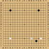

  
  [LinkedIn](https://www.linkedin.com/in/aaron-pettengill-7706846b/) • [Twitter](https://twitter.com/PettengillAaron)
  

  
Rules

  <ul>
    <li>Click on any legal move in the "Make a move" section below at any time to play a move for either player.</li>
    <li>Every 6 hours, a move will be played by KataGo with a low number of playouts.</li>
    <li>The game ends when KataGo passes or resigns.</li>
    <li>Completed games are stored in the <strong>history</strong> folder in this repo.</li>
  </ul>

<!-- MOVES START -->

<!-- MOVES END -->